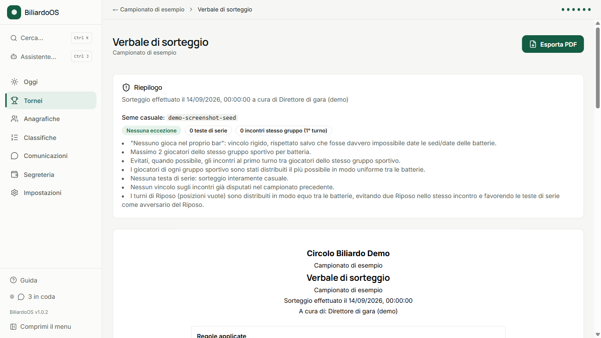
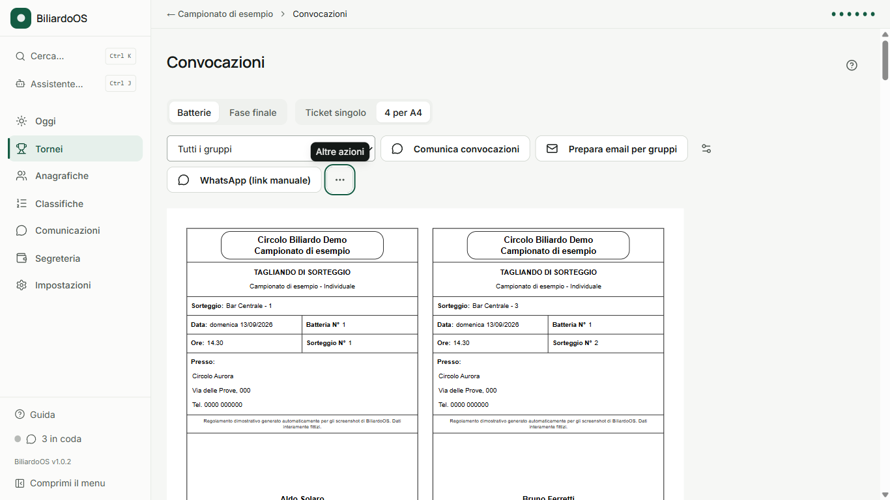
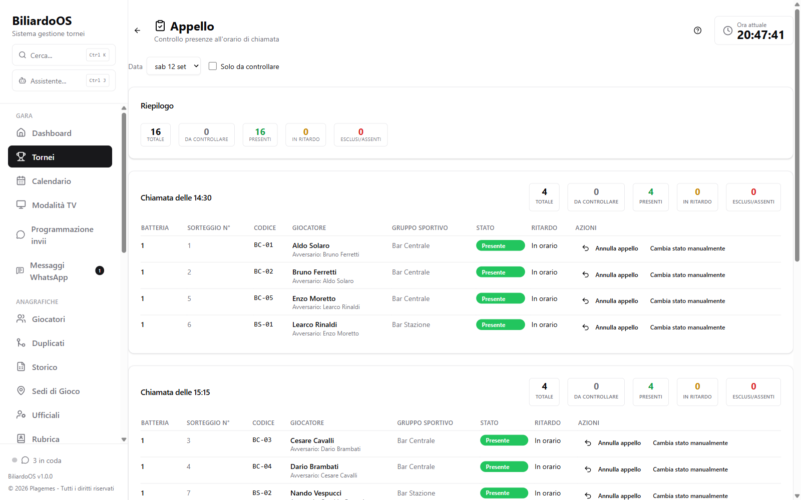
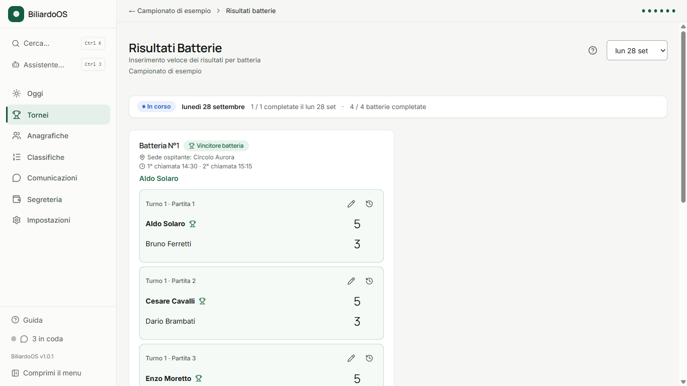
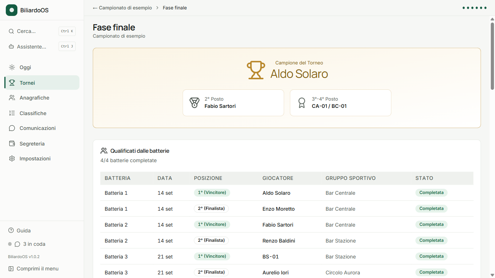
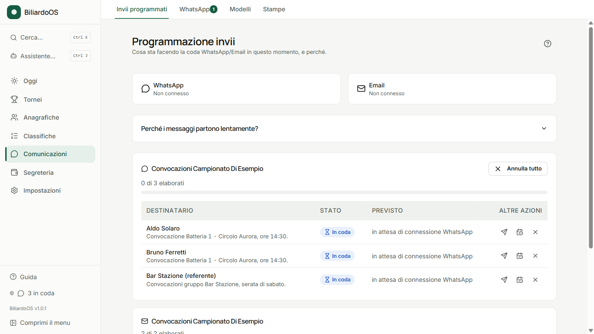
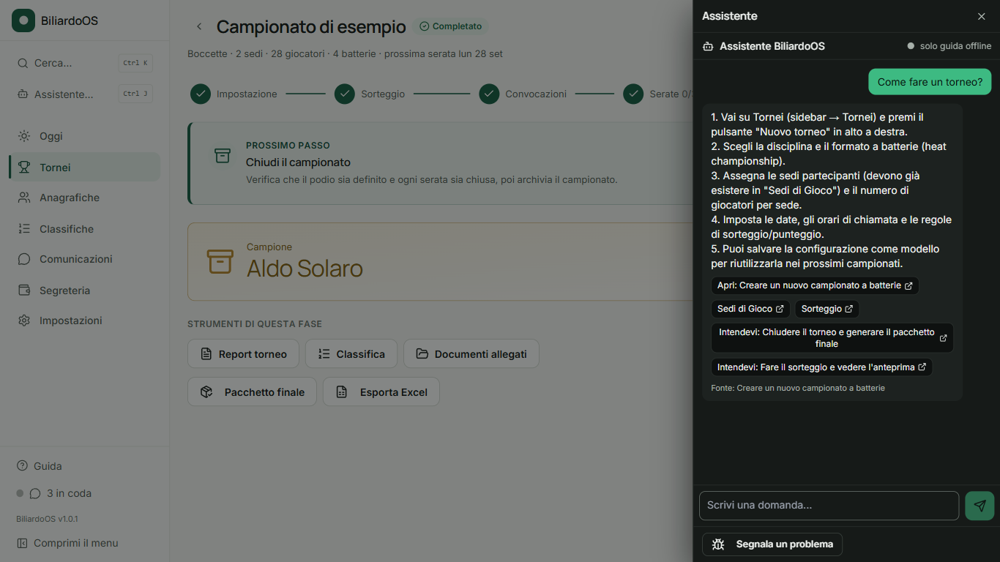
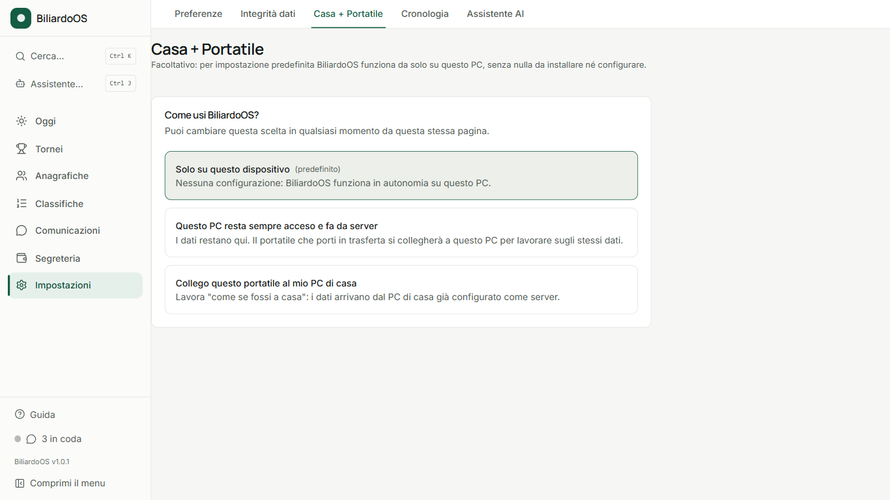

🇮🇹 Italiano | 🇬🇧 [English](README.md)

# BiliardoOS

### Gestione campionati a batterie di biliardo

### ⬇️ [**Scarica BiliardoOS**](https://github.com/Plagemes/biliardoos-releases/releases/latest)

🔗 Link da condividere: **https://plagemes.github.io/biliardoos-releases/**

*Gratuito, per Windows 10/11 - vedi [Installazione](#installazione) per l'avviso di SmartScreen*

---

## Cos'è

**BiliardoOS** è un gestionale desktop per organizzare un **campionato a
batterie** (heat championship) di biliardo/boccette - il formato con
batterie da 8 o 4 giocatori (o coppie) seguite da una fase finale a
eliminazione, tipico dei campionati amatoriali tra bar e circoli.

Non è un prodotto ufficiale UISP e non usa loghi UISP: è pensato per
qualunque circolo o associazione che organizzi un campionato amatoriale a
batterie, dal sorteggio della prima serata fino al podio finale, con
convocazioni, appello, risultati, classifiche, comunicazioni WhatsApp/email
e un assistente AI locale che gira interamente sul PC dell'utente.

Tutti i dati restano sul PC di chi organizza: nessun account da creare,
nessun servizio cloud da pagare, nessun dato inviato a terzi.

## Funzionalità

### 🎲 Sorteggio intelligente

Sorteggio automatico delle batterie (da 8 o da 4, singoli o coppie), con
regole configurabili - nessun giocatore nel proprio bar, distribuzione
uniforme dei gruppi sportivi, teste di serie per classifica/ELO - e
un'anteprima con punteggio di qualità prima di confermare. Ogni sorteggio
produce un verbale ("Anteprima sorteggio" / "Verbale di Sorteggio")
esportabile in PDF, con seed riproducibile.

### 🎫 Convocazioni e tagliandi

Tagliandi di convocazione in PDF, impaginati 4 per foglio A4 per la stampa
in sede oppure singoli per l'invio via email/WhatsApp, con orari di
chiamata calcolati automaticamente.

### ✅ Appello e risultati

Appello/check-in con gestione ritardi (tolleranza, penalità, esclusione ed
eventuale walkover) e inserimento risultati in tempo reale, con
classifiche e qualificazioni aggiornate a ogni partita - anche da telefono
tramite il server LAN di sola lettura ("Risultati sul telefono").

  
  

### 🏆 Fase finale e classifiche

Generazione automatica del tabellone della fase finale dai risultati delle
batterie, fino al podio, con classifiche di stagione (individuali e per
gruppo/sede), albo d'oro e statistiche avanzate.

### 💬 Comunicazioni WhatsApp/email con anti-blocco

WhatsApp integrato (nessuna app esterna da installare) ed email via Gmail o
Outlook, con instradamento automatico sul canale disponibile per ciascun
destinatario. La coda invii ha un sistema anti-blocco (ritardi casuali,
limiti orari/giornalieri, pause periodiche, orari di silenzio, interruttore
automatico in caso di anomalie) e una pagina di trasparenza che mostra cosa
sta facendo la coda in questo momento e perché.

### 🤖 Assistente AI locale e su WhatsApp

Un assistente AI **locale** (basato su [Ollama](https://ollama.com)), con
installazione e aggiornamento automatico del motore e scelta del modello in
base all'hardware del PC: risponde a domande sull'uso del programma, con
collegamenti diretti alle pagine giuste. Lo stesso assistente può rispondere
anche ai giocatori su WhatsApp, con approvazione dell'organizzatore per le
richieste sensibili.

### 🔗 Collegamento casa/portatile e telefono in sede

Collegamento facoltativo tra un PC "di casa" e un portatile in trasferta
(via [Tailscale](https://tailscale.com) o sincronizzazione su cartella
condivisa come Google Drive), e una modalità "serata offline" per una sede
remota, con inserimento risultati da telefono tramite PIN dedicato.

### 🔒 Privacy e backup

Gestione del consenso privacy (GDPR), password opzionale di blocco app,
backup locali automatici/manuali, copia di sicurezza esterna opzionale
(OneDrive/USB/NAS) e controllo integrità dati automatico con riparazione
sicura.

---

## Requisiti

- **Windows 10 o 11** (64-bit).
- Circa **200 MB** di spazio disco per l'app, più **1-2 GB opzionali** se si
  usa l'assistente AI locale (download del modello).
- Nessuna connessione a Internet richiesta per l'uso quotidiano; serve solo
  per gli aggiornamenti automatici e, se usato, per il primo collegamento di
  WhatsApp/email e il download del modello AI.

## Installazione

1. Scarica `BiliardoOS-Setup-<versione>.exe` dalla
   [pagina delle release](https://github.com/Plagemes/biliardoos-releases/releases/latest).
2. Avvialo con un doppio clic.

### Avviso di Windows SmartScreen

BiliardoOS non è (ancora) firmato con un certificato di firma del codice, un
servizio a pagamento non indispensabile per un programma di uso
interno/associativo. Al primo avvio vedrai un avviso come:

> **"Windows ha protetto il PC"** - *"Impossibile verificare l'editore..."*

È previsto e innocuo: clicca su **"Ulteriori informazioni"**, poi su
**"Esegui comunque"**. L'avviso compare perché l'eseguibile non è firmato
digitalmente, non perché contenga qualcosa di dannoso.

L'installer si installa **per l'utente corrente**, senza richiedere permessi
di amministratore (con l'opzione di installarlo per tutti gli utenti, se
preferito), crea un collegamento su Desktop e menu Start, ed è interamente
in italiano.

## Aggiornamenti automatici

BiliardoOS controlla ed installa da solo le nuove versioni pubblicate qui,
su GitHub - nessun account, nessuna configurazione richiesta: il
controllo avviene all'avvio (silenzioso se non trova nulla) e può anche
essere forzato da Impostazioni → **Aggiornamenti**. Un aggiornamento non
viene mai installato durante una serata di gara aperta, ed è sempre
preceduto da un backup automatico dei dati.

## Privacy

**Tutti i dati del campionato restano sul PC di chi organizza**: giocatori,
tornei, risultati e comunicazioni sono salvati localmente, mai su un
server esterno. L'assistente AI **gira in locale** (Ollama, sul PC
dell'utente): le domande e le risposte non vengono inviate a nessun
servizio cloud di terze parti. L'unico traffico verso l'esterno è quello
strettamente necessario per gli aggiornamenti automatici e, se
attivati dall'utente, per l'invio effettivo di email/messaggi WhatsApp.

## FAQ

**Devo pagare qualcosa?**
No, BiliardoOS è gratuito.

**Serve un account o un abbonamento a qualche servizio cloud?**
No. I dati restano sul PC. WhatsApp ed email sono facoltativi e usano il
tuo numero/account esistente, senza servizi terzi a pagamento.

**Funziona anche senza Internet?**
Sì, per l'uso quotidiano (sorteggio, convocazioni stampate, appello,
risultati, classifiche). Internet serve solo per gli aggiornamenti
automatici e per le funzioni che richiedono un invio reale
(WhatsApp/email) o il download del modello AI.

**L'assistente AI invia i miei dati a servizi esterni?**
No: l'assistente gira in locale sul PC tramite Ollama. Nessun dato di
giocatori o tornei lascia il PC per l'assistente AI.

**Perché Windows mostra un avviso all'installazione?**
Perché l'installer non è firmato con un certificato di firma del codice
(a pagamento). Vedi [Installazione](#installazione) qui sopra.

**Posso usarlo su più PC (casa e portatile)?**
Sì, tramite la funzione facoltativa "Collegamento casa/portatile"
(Tailscale o cartella condivisa) - vedi la sezione dedicata sopra.

**Posso modificare o redistribuire il programma?**
No: BiliardoOS è freeware "as-is", non open source - vedi
[Licenza](#licenza).

**Dove trovo il manuale completo?**
In-app, alla voce **Guida** del menu laterale, oppure chiedendo
direttamente all'assistente AI integrato.

## Supporto e idee

- Hai una domanda, un dubbio o un'idea? Apri una discussione nella sezione
  [**Discussions**](https://github.com/Plagemes/biliardoos-releases/discussions).
- Hai trovato un problema? Apri una
  [**Issue**](https://github.com/Plagemes/biliardoos-releases/issues/new/choose)
  - se possibile allega il "pacchetto di supporto" generabile da Impostazioni
    → "Segnala un problema" (raccoglie log e informazioni diagnostiche, mai
    dati personali dei giocatori).

## Licenza

BiliardoOS è **freeware**: uso gratuito consentito, ma **tutti i diritti
sono riservati** - non è consentito rivendere, modificare o ridistribuire
il programma senza permesso, ed è fornito "così com'è", senza garanzie.
Vedi il testo completo in [`LICENSE`](./LICENSE).

---

Se BiliardoOS ti è utile, lascia una ⭐ al progetto!
